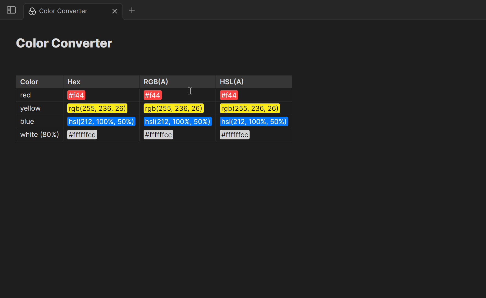

# Overview

Color Converter is a plugin for Obsidian.md which allows you to convert highlighted color codes between various formats, including HEX, RGB(A), and HSL(A).

> [!NOTE]
> This plugin is still in beta. If you have any feedback to share or want to report a bug, please feel free to do so in the Issues tab.

To convert a color to a new format, highlight your selected color, open the command palette (`Ctrl` + `p`), search for **Color Converter**, and select your desired output format. Alternatively, you may assign a hotkey to each conversion type. To access the hotkey options, go to **Settings** → **Community plugins** → **Color Converter** and select the plus symbol.

> [!TIP]
> This demonstration gif uses [Color Highlighter](https://www.github.com/heatherpiper/color-highlighter), an Obsidian plugin for highlighting colors in notes.

# Supported formats:

- HEX (with or without the escape character `\`)
  - #RGB
  - #RGBA
  - #RRGGBB
  - #RRGGBBAA
- HSL
- HSLA
- RGB
- RGBA

> [!TIP]
> Colors will be converted to the format which matches the presence of an alpha channel value (RGB will convert to HSL but not HSLA).

# Installation

## Install manually

As this plugin is currently in beta, it's not yet available in the Obsidian community plugins browser.

To install:

1. Download the [latest release](https://www.github.com/heatherpiper/color-converter/releases) files (`main.js` and `manifest.json`).
2. Create a new folder inside your Obsidian vault's plugin directory at `.obsidian/plugins/color-converter.`
3. Move the downloaded files into the new folder.
4. Reload Obsidian.
5. Go to **Settings** → **Community plugins** and enable Color Converter.

## Install using BRAT

BRAT (Beta Reviewers Auto-update Tool) is a community plugin that makes it easier to review and test new plugins and themes that are still in beta. Updates are downloaded automatically without the need for the user to manually change any files.

To install using BRAT:

1. Make sure you have installed and enabled the BRAT plugin from the Obsidian community plugins browser.
2. Copy this link: `https://github.com/heatherpiper/color-converter`
3. Open the command palette and select the command **BRAT: Add a beta plugin for testing.**
4. Paste the link into the pop-up modal and select **Add Plugin**.
5. After BRAT confirms the installation, go to **Settings** → **Community plugins** and enable Color Converter. You made need to first refresh the list of plugins.
